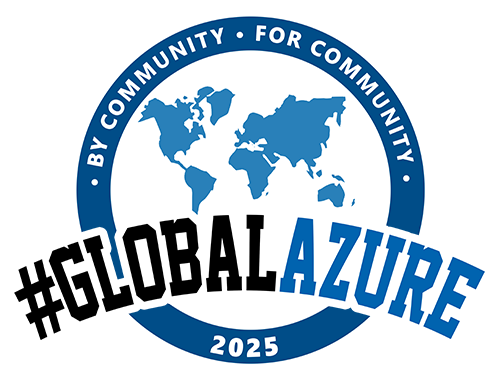
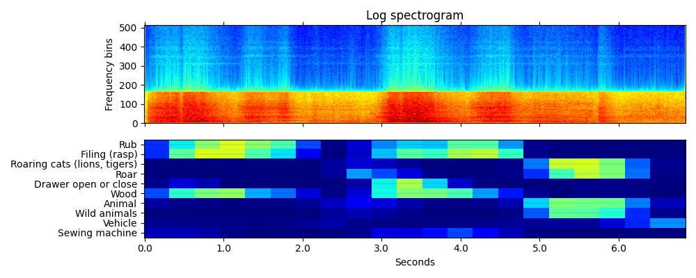
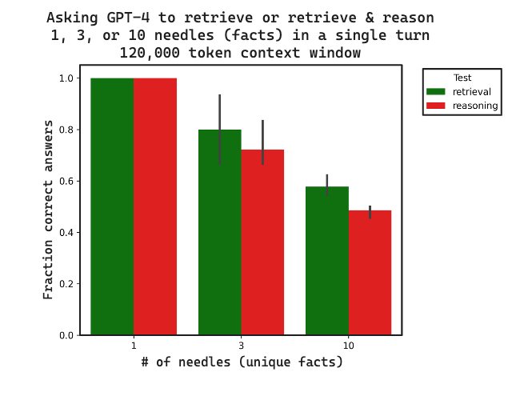
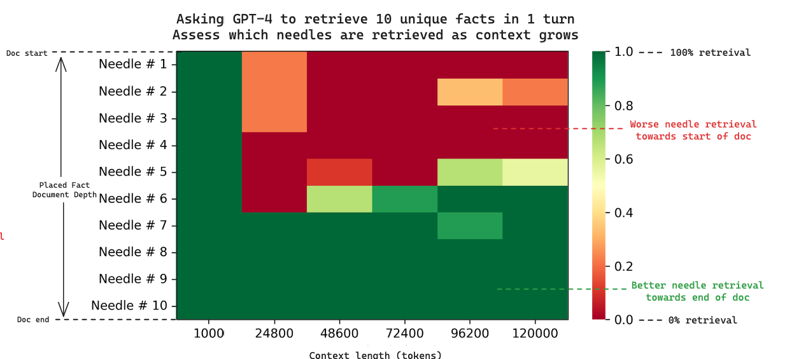

# Hardening Multi-Modal RAG System Against Hallucinations
\
\
\
\
**Zahhar Kirillov**  
Technology Consultant
EPAM Systems (Switzerland) GmbH
\
\
Global Azure, May 2025

---

## Agenda

1. RAG in Azure
1. Why RAG hallucinates?
1. Demo
1. Hardening strategies
1. Key Takeaways

---

## RAG...

- is a GenAI technique that provides answers based not only on  pre-trained knowledge of LLM, but combines it with retrieved most relevant additional context.
- promises reduced hallucinations, higher accuracy and larger flexibility without necessity to train own model (at least according to marketing)

---

## Multi-Modal RAG...

- Takes any media (Text, Image, Audio, Video – or their combination) as User Prompt 
- Uses any media as additional context
- Provides any media type as response

## Examples:

- Helpdesk AI agent resolves issues by user screenshot with an error message
- Finding most relevant images from image bank based on slide content
- Suggesting similar music based on provided reference audio

--- 

## Hallucination in RAG is...

**Incorrect, misleading, or fabricated response** provided by GenAI, for example:
* Not aligned with user ask
* Not grounded (linked) to relevant data source
* Relies on (outdated) internal knowledge instead of supplemented context

---

## Hallucinations in Multi-Modal LLM

_What is written here?_

> Please do NOT to make any heath decisions or provide medical advise based on image analysys, LLM picture description or RAG interpretation.

---

## Hallucination in RAG is...

**Dangerous**, because user has high expectations towards RAG responses (_"RAG promises reduced hallucinations, higher accuracy and larger flexibility_")
* Costly to fix mistake user relies on RAG response to take an action
* Risky if RAG used for business purposes in regulated industries
* Difficult to troubleshoot and avoid due to GenAI nature and solution complexity
* Decreases time efficientcy, while increases operational costs
* Undermines trust in GenAI solutions in general

---

## What is the source of hallucination?

---

## While hallucination occurs in LLM, **any** component may contribute into it.

---

## RAG system design inventory in Azure

---

## In complex architectures fixing hallucinations is a challenge

---

## Why RAG hallucinates? (1/2)

---

## Why RAG hallucinates? (2/2)

---

## Hardening Strategies: Query issues

– **User**: "How a seal looks like?"
– **LLM**: (_hallucinates_)

--- 

---

## How make LLM to understand what is a 'seal'? 
**Provide context:**
- Ask user a follow-up question 
    - "_Do you mean seal as an animal?_"
- Make educated guess based on conversation history
    - Earlier user typed: "_We saw a seal sunbathing on the rocks near the shore._"
- Provide context in System prompt (business domain, user role, project name, etc.)
    - "_You are AI assistant for the Zoo visitors_"
    - "_You are AI assistant for plumbing company_

---

## Hardening Strategies: Retrieval issues

RAG provide answer based on N most similar data items for the given input. For example, by calculating`cosine similarity` between vectors obtained with embedding model.

<i>Special thanks to my colleague Pavel Agurov who shared with me this example.</i>

---

## How LLM uses embeddings to understand any media (2/2)

---

## _The **seal** clapped its flippers and made a funny sound._

<table>
    <thead>
        <tr>
            <th>text-embedding-ada-002</th>
            <th>text-embedding-3-large</th>
        </tr>
    </thead>
    <tbody>
        <tr>
            <td colspan="2" align="center">We saw a seal sunbathing on the rocks near the shore.</td>
        </tr>
        <tr>
            <td>0.8578518087693727</td>
            <td>0.45539295595853985</td>
        </tr>
        <tr>
            <td colspan="2" align="center">Baby seals have soft white fur to keep them warm.</td>
        </tr>
        <tr>
            <td>0.83152302986493</td>
            <td>0.4042570801157547</td>
        </tr>
        <tr>
            <td colspan="2" align="center">The official document had a red seal at the bottom.</td>
        </tr>
        <tr>
            <td>0.8033582979078897</td>
            <td>0.2962111837305739</td>
        </tr>
                <tr>
            <td colspan="2" align="center">Make sure the seal on the jar is tight.</td>
        </tr>
        <tr>
            <td>0.8007569564368632</td>
            <td>0.24096357016376618</td>
        </tr>
    </tbody>
</table>

---

## Hardening Strategies: Indexing & Retrieving audio
\
\
\
\
\
\
\
\
\
\
\

---

## How LLM uses embeddings to understand any media (2/2)

---

## Hardening Strategies: Retrieval issues

- Text embedding models: `ada-002`, `text-embedding-3-large`
- Audio embedding models: `openl3`, `YamNet`, `WavLM`, `CLAP`, `VGGish`, `PANNs`
- Image embedding models: `Microsoft Azure Multimodal Embedding API`, `CLIP`

> Use multi-modal embeddings where possible, augment with classifier (categories/tags), free-text description (what is audio/video/image is about) and metadata (file type, size, name, author, date, etc.)

---

## Hardening Strategies: Data quality (1/2) – OCR vs OCR + CV

<table>
<tr><th width="50%">OCR only</th><th width="50%">OCR + CV</td>
<tr><td>Does this financial product have a sustainable investment objective? Yes No</td> 
<td width="50%">Does this financial product have a sustainable investment objective?
  [:unchecked:] Yes [:checked:] No
</td></tr></table>

---

## Hardening Strategies: Data quality (2/2) - Table conversion

> Summary: This table is a risk assessment matrix for investment funds. Table has 1 row in total. Each row represents an investment fund. Columns represent various risk types or risk characteristics.
<pre>
{
  "fund_name": "Asian Dragon Fund", 
  "specific_risk_considerations": ["Small Cap", "Equity risk"]
}
</pre>

---
## Hardening Strategies: Generation issues (1/3) - Reducing context

|  |  |
|--|--|
|   | |

Source: https://blog.langchain.dev/multi-needle-in-a-haystack/ 

---

## Hardening Strategies: Generation issues (2/3) - using LogProbs

> This technique is not (yet?) available in Azure OpenAI when used with 'data_sources'. Alternative is 'strictness' parameter, or feeding back 'citations'.

Let same or another LLM to evaluate response based on same context as ws used for generation, and ask to reply with structured output (in pseudocode):
<pre>
{
  "RAG_respose": "String"
  "RAG_response_is_firmly_grounded_to_provided_context": "True or False"
}
</pre>

<pre>
{
  "RAG_respose": "Once upon a time..." # or image
  "RAG_response_is_firmly_grounded_to_provided_context": "True"
}
//Token probability for 'True': -1.7289681 (18%) -> hints hallucination
</pre>

---

## Hardening Strategies: System design
    
|Issue|Strategy|
|--|--|
|No QA|Azure AI Foundry features 'ungrounded_attributes' and other safety evaluations|
|No feedback loop|Let user upvote/downvote LLM responses, in case of downvote - ask permission to log everything and analyze it for improvemet. |
|Outdated / unfit model|Stick to newest models, e.g. 'gpt-4.5-preview', 'gpt-4.1' |

---

## Key Takeaways

1. Hallucinations are a significant risk for RAG adoption: educate users
1. Anticipating sources of hallucinations is a key to reduce them
1. Azure provides all components for robust foundation of your Multi-Modal RAG system
1. Start small: design for simplicity and let it evolve as your data & demand grow
1. Use most advanced (and suitable for your use-case) models
1. Use long, rich and detailed system prompt (it'll be cached)
1. Store & search all: embeddings from text & media properties, metadata
1. Prefer HTML tables over Markdown, and Markdow formatting over plain text or HTML
1. Don't be strict: allow LLM to say "I do not know"; allow user to say "I (dis)like it"
1. "Junk in -> Junk out": low-quality data won't provide high-quality output

---

## Thank You!

**Questions?**  
Ask now, or send email: zahhar_kirillov@epam.com

**Download presenantion:**
[https://github.com/zahhar/global_azure/](https://github.com/zahhar/global_azure/)
