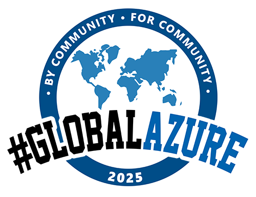
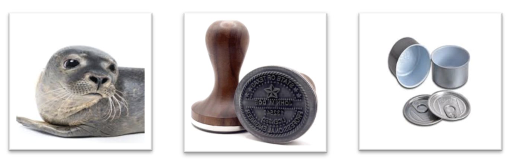
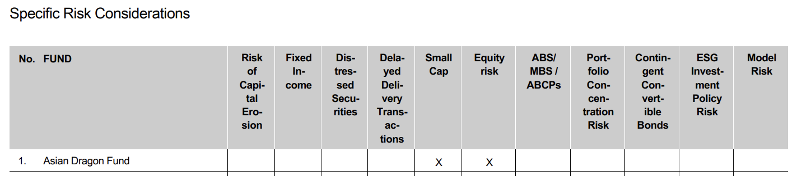
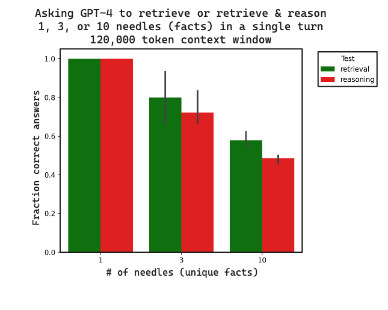
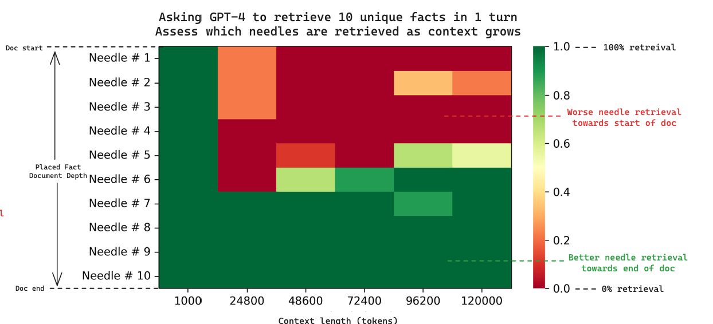

# Hardening RAG system against hallucinations
\
\
\
\
**Zahhar Kirillov**  
Technology Consultant
EPAM Systems (Switzerland) GmbH
\
\
Munchen, 8. May 2025

---

## Agenda

1. RAG in Azure
2. Why RAG hallucinates?
3. Hardening strategies
4. Demo
5. Key Takeaways

---

## Agenda (Revisited as you asked)

1. <mark>**Demo**</mark>
1. RAG in Azure
1. Why RAG hallucinates?
1. Hardening strategies
1. Key Takeaways

---

## RAG...

- is a GenAI technique that provides answers based not only on  pre-trained knowledge of LLM, but combines it with retrieved most relevant additional context.
- promises reduced hallucinations, higher accuracy and larger flexibility without necessity to train own model (at least according to marketing)

---

## Let's see RAG in action

1. Response without hallucination
    - **User**: "_What risk management measure is used for The Sustainable Fixed Income Global Opportunities Fund?_"
2. Responses with hallucinations
    - **User**: "_What risk management measure is used for The Sustainable Energy Fund?_"
    - **User**: "_List all funds from this prospectus that are exposed to Turnover risk_"
    - **User**: "_List funds that have a sustainable investment objective?_"

---

## Agenda

1. ~~Demo~~
1. <mark>**RAG in Azure**</mark>
1. Why RAG hallucinates?
1. Hardening strategies
1. Key Takeaways

---

## RAG system design inventory in Azure

---

## RAG system design inventory in Azure (explained)

---

## Agenda

1. ~~Demo~~
1. ~~RAG in Azure~~
1. <mark>**Why RAG hallucinates?**</mark>
1. Hardening strategies
1. Key Takeaways

--- 

## Hallucination in RAG is...

**Incorrect, misleading, or fabricated response** provided by GenAI:
* RAG says _"I do not know"_, while it should know, because there is relevant information available somewhere in RAG the data sources
* RAG says _"I know"_, but cannot (correctly) ground response to the data source
* RAG bypassess provided context ans relies on (outdated) internal knowledge
* RAG provides partial response, but pretends it is complete

---

## Hallucination in RAG is...

**Dangerous**, because user has high expectations towards RAG responses (_"RAG promises reduced hallucinations, higher accuracy and larger flexibility_")
* Costly to fix mistake user relies on RAG response to take an action
* Risky if RAG used for business purposes in regulated industries
* Difficult to troubleshoot and avoid due to GenAI nature and solution complexity
* Decreases time efficientcy, while increases operational costs
* Undermines trust in GenAI solutions in general

---

## What is the source of hallucination?

---

## While hallucination occurs in LLM, **any** component may contribute into it.

---

## In complex architectures fixing hallucinations is a challenge

---

## Why RAG hallucinates?

mindmap
  root((Hallucinations))
    Query Issues
    Data Quality
    Retrieval Issues
    Generation Issues
    System Design

---

## Why RAG hallucinates: Query Issues

mindmap
  root((Hallucinations))
    Query Issues
      Ambiguous queries
      Implicit requests
      Multiple questions in one query
      Misunderstandings
        Too short query
        Cultural references
        Unknown terminology & abbreviations  

---
## Why RAG hallucinates: Data Quality

mindmap
  root((Hallucinations))
    Query issues
    Data Quality
      "Lost in translation"
      Outdated content
      Contradictory info
      Data loss during extraction
      Content poisoning

---
## Why RAG hallucinates: Retrieval Issues

mindmap
  root((Hallucinations))
    Query issues
    Data Quality
    Retrieval Issues
      Irrelevant chunks
      Suboptimal chunking
      Poor ranking
      Too few/may chunks

---

## Why RAG hallucinates: Generation Issues

mindmap
  root((Hallucinations))
    Query issues
    Data Quality
    Retrieval Issues
    Generation Issues
      Math/Reasoning queries
      Wrong model settings
      Unclear instructions
      Suboptimal strcutures
      No fallback
      Outdated model

---

## Why RAG hallucinates: System Design

mindmap
  root((Hallucinations))
    Query issues
    Data Quality
    Retrieval Issues
    Generation Issues
    System Design
      No QA by design
      No feedback loop

---

## Why RAG hallucinates?

mindmap
  root((Hallucinations))
    Query issues
      Ambiguous queries
      Implicit requests
      Multiple questions in one query
      Misunderstandings
        Too short query
        Cultural references
        Unknown terminology & abbreviations  
    Data quality
      "Lost in translation"
      Outdated content
      Contradictory info
      Data loss during extraction
      Content poisoning
    Retrieval issues
      Irrelevant chunks
      Suboptimal chunking
      Poor ranking
      Too few or too many chunks
    Generation issues
      Math/Reasoning queries
      Wrong model settings
      Unclear instructions
      Suboptimal strcutures
      No fallback
      Outdated model
    System design
      No QA by design
      No feedback loop

---

## Agenda

1. ~~Demo~~
1. ~~RAG in Azure~~
1. ~~Why RAG hallucinates?~~
1. <mark>**Hardening strategies**</mark>
1. Key Takeaways

---

## Hardening Strategies: Query issues (1/3)

– **User**: "Wie viele VP hat die Swiss Chocolate AG?"
– **RAG**: "Mir ist kein VP bekannt bei der Swiss Chocolate AG"
– **User** (calls developer): WTF?!?!?!? Your RAG is not working properly, because I know for sure there must be thousands of VPs in Swiss Chocolate AG!

> Truth: GenAI assumed "VP" means "_Vice-President_", while user wanted "_Versicherte Person_" (Insured Person) – typical abbreviation in insurance business domain

--- 

## Hardening Strategies: Query issues (2/3)

|Issue|Strategy|
|--|--|
|Industry vocabulary, non-standard abbreviations -> RAG interprets query differently  | Extend system prompt with custom vocabulary; Educate users and show good examples. |
|Several questions in one query -> RAG answers only one or not at all | Use pre-flight prompt to extract list of questions from User Prompt, answer them iteratively, and combine into final response.|
|Cultural References, e.g. "football" may mean "soccer" or "american footbal"|Provide in System prompt details about user language, location, job title, timezone, project role, department, etc.|

--- 

## Hardening Strategies: Query issues (3/3)

|Issue|Strategy|
|--|--|
|Implicit or ambiguous words: "this", "ours", "it", "best", "previous", "today", "all"| Use pre-flight prompt to detect ambiguity and follow-up with clarification questions; RegExp replacement; Maintain conversation history; Enrich system prompt with current date & time, day of the week and other context |
|Very short requests: "_Why I can't login?_"|Use query expansion, e.g. HyDE (Hypothetical Document Embeddings). Azure AI Search offers alternative _magic_ with **'max_search_queries'** parameter.|
|Homonyms (_Bank, Nagel, Schloss, Leiter, Gericht, Decke, Glass_)|Experiment with embedding model; use query expansion; let user specify the domain (e.g. "Finance & Banking" vs "Home & Ganden")

--- 

## How embedding model affects homonyms understanding? 

Let's calculate _cosine similarity_ between reference sentense and sentenses with homonyms using embedding models available in Azure OpenAI.

---

## _The **seal** clapped its flippers and made a funny sound._

<table>
    <thead>
        <tr>
            <th>text-embedding-ada-002</th>
            <th>text-embedding-3-large</th>
        </tr>
    </thead>
    <tbody>
        <tr>
            <td colspan="2" align="center">We saw a seal sunbathing on the rocks near the shore.</td>
        </tr>
        <tr>
            <td>0.8578518087693727</td>
            <td>0.45539295595853985</td>
        </tr>
        <tr>
            <td colspan="2" align="center">Baby seals have soft white fur to keep them warm.</td>
        </tr>
        <tr>
            <td>0.83152302986493</td>
            <td>0.4042570801157547</td>
        </tr>
        <tr>
            <td colspan="2" align="center">The official document had a red seal at the bottom.</td>
        </tr>
        <tr>
            <td>0.8033582979078897</td>
            <td>0.2962111837305739</td>
        </tr>
                <tr>
            <td colspan="2" align="center">Make sure the seal on the jar is tight.</td>
        </tr>
        <tr>
            <td>0.8007569564368632</td>
            <td>0.24096357016376618</td>
        </tr>
    </tbody>
</table>

--- 

## Hardening Strategies: Data quality (1/3)

|Issue|Strategy|
|--|--|
|"Lost in translation"|Azure AI Hybrid Search; Multi-lingual embeddings; Keep originals; detect query language and apply same laguage embeddings or translate query|
|Outdataed content|Store document date & revision in metadata, apply default filter unless user asks for version history/comparison|
|Contradictory info|Rich Metadata for scoring based on date, author reputation, data source (law, internal)|
|Content poisoning: malicious user planted misinformation. | Content authoring/curation, digital signatures, avoiding UGC or marking it as ureliable for re-ranking |

---

## Hardening Strategies: Data quality (2/3) - Data loss 

|Issue|Strategy|
|--|--|
|Redaction gaps|Do not blindly remove PII, passwords, but replace with [PASSWORD], [CLIENT_NAME], [USERNAME] to preserve meaning.|
|Only plain text captured|Use OCR and Markdown to capure forms, checkboxes, formatting; extract images/charts/diagrams and replace them "in-place" with detailed descriptions, keeping original image in metadata.
|Corrupted tabular data|Prefer HTML tables (they preserve colspan/rowspan); keep whole table in one chunk or break semantically (by columns); Convert sparse tables into 'row-column-value' facts and store as JSON-LD or JSONL.|
|Context lost in chunking|Experiment with length, overlap. Semantical / smart chuking. Enrich chunks by adding tags / keywords into it or replace ambigous words.|

---

## Hardening Strategies: Data quality (3/3) - Table conversion

<pre>
{"fund_name": "Asian Dragon Fund", "small_cap": "True"}
{"fund_name": "Asian Dragon Fund", "equity_risk": "True"}
</pre>
<pre>
{
  "fund_name": "Asian Dragon Fund", 
  "specific_risk_considerations": ["Small Cap", "Equity risk"]
}
</pre>

---

## Hardening Strategies: Retrieval issues

|Issue|Strategy|
|--|--|
|Irrelevant chunks|Hybrid search (vector + keywords), semantic ranking, query expansion, web search or tool calling|
|Poor ranking|Re-ranking based on scoringProfiles, two-stage retrieval with GnAI-reranking |
|Too few or too many chunks|search.in() for OR logic or filter 'lastUpdated>2025-01-01'; 'top_n_documents' parameter tuning, incl. dynamically|

---

## Hardening Strategies: Generation issues (1/2)
    
|Issue|Strategy|
|--|--|
|Math/Reasoning queries|Use reasonig model; use tool calls; adjust system promt to think step-by-step; use structured output; find 1 needle at a time; reduce context to most relevant chunks. |
|Temperature (and other) settings|Decrease temperature or set it dynamically, experiment with values on same set of queries|
|Unclear system prompt|Use detailed & dynamic system prompts with rules, examples, persona, examples of desired output. |
|No fallback|Instruct LLM to "Say 'I don't know' if uncertain"; use Optional fields in pydantic structures|

---
## Hardening Strategies: Generation issues (2/2) - Reducing context

|  |  |
|--|--|
|   | |

Source: https://blog.langchain.dev/multi-needle-in-a-haystack/ 

---

## Hardening Strategies: System design (1/2)
    
|Issue|Strategy|
|--|--|
|No confidence score|Use LogProb to assess LLM confidence in response |
|No QA|Azure AI Foundry features 'ungrounded_attributes' and other safety evaluations|
|No feedback loop|Let user upvote/downvote REG responses, in case of downvote - ask permission to log everything and analyze it for improvemet. |
|Outdated model|Stick to newest models, e.g. 'gpt-4.5-preview', 'gpt-4.1' |

---

## Hardening Strategies: System design (2/2) - using LogProbs

> This technique is not (yet?) available in Azure OpenAI when used with 'data_sources'. Shallow alternative is 'strictness' parameter.

Ask RAG to reply with structured output like this (in pseudocode):
<pre>
{
  "RAG_respose": "String"
  "RAG_response_is_firmly_grounded_to_provided_context": "True or False"
}
</pre>

<pre>
{
  "RAG_respose": "Once upon a time..."
  "RAG_response_is_firmly_grounded_to_provided_context": "True"
}
//1st token probability for 'True' token: -1.7289681, or 18%
</pre>

---

## Agenda

1. ~~Demo~~
1. ~~RAG in Azure~~
1. ~~Why RAG hallucinates?~~
1. ~~Hardening strategies~~
1. <mark>**Key Takeaways**</mark>

---

## Key Takeaways

1. Hallucinations are a significant risk for RAG adoption: educate users
1. Anticipating sources of hallucinations is a key to reduce them
1. Azure provides all components for robust foundation of your RAG system
1. Start small: design for simplicity and let it evolve as your data & demand grow
1. Use most advanced embedding and inference models
1. Use long, rich and detailed system prompt (it'll be cached)
1. Start with longer chunks, enrich them with metadata, keep the context
1. Prefer HTML tables over Markdown, and Markdow formatting over HTML
1. Don't be strict: allow LLM to say "I do not know"; allow user to say "I (dis)like it"
1. "Junk in -> Junk out": low-quality data won't provide high-quality output

---

## Thank You!

**Questions?**  
Ask now, or send email: zahhar_kirillov@epam.com